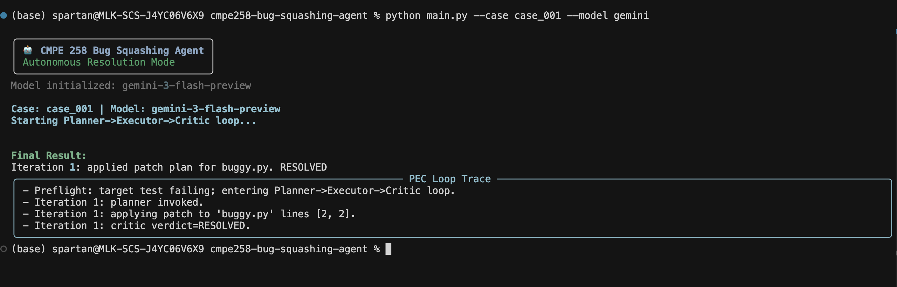
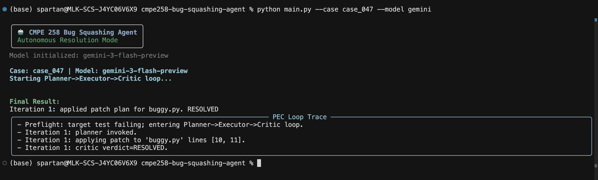
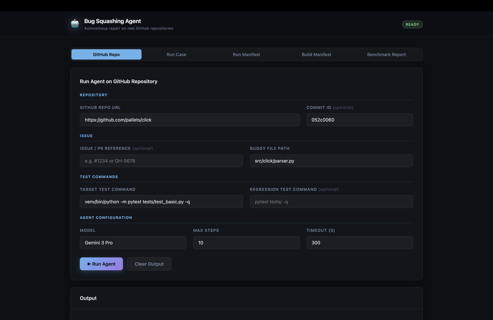
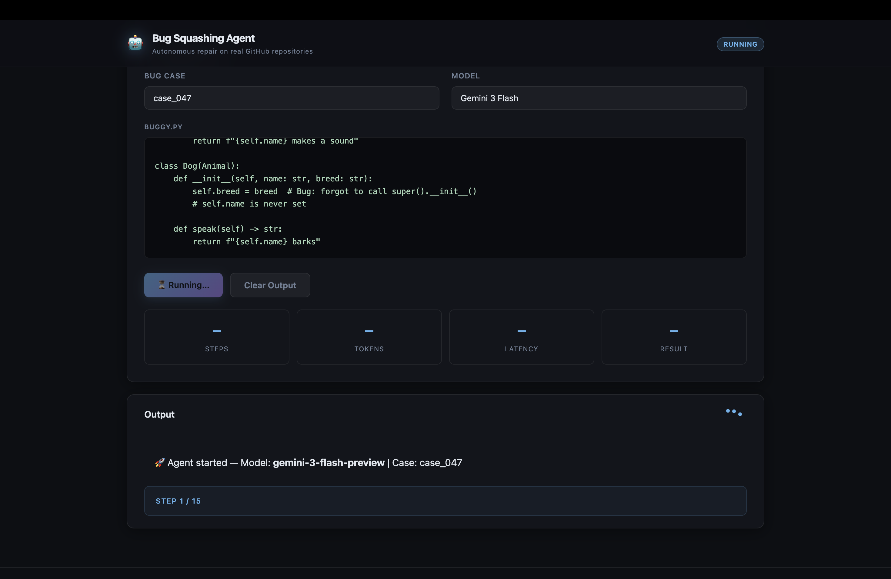
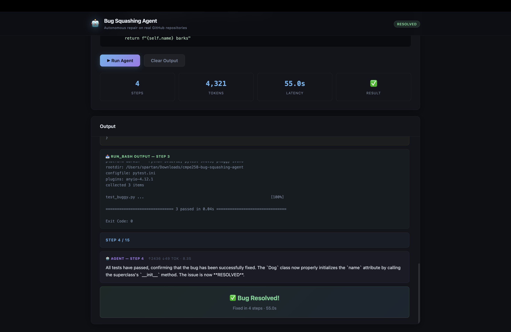
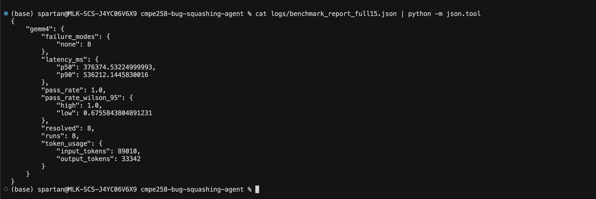
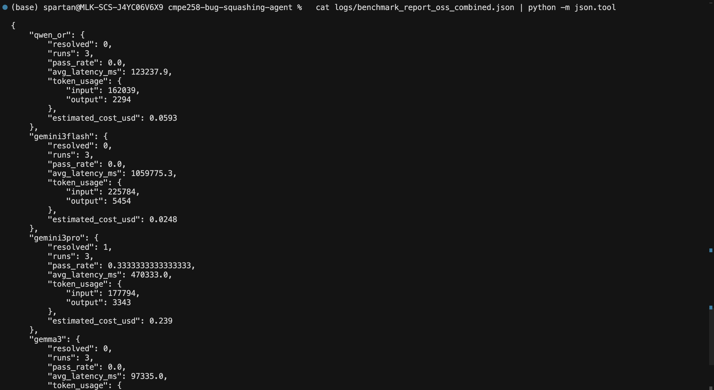
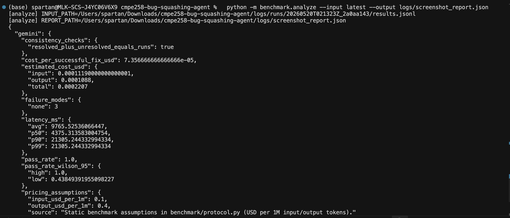
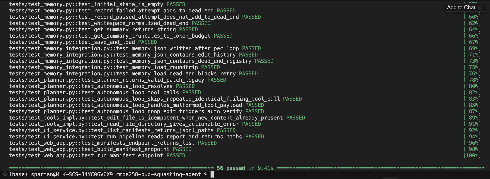

# Autonomous Bug-Squashing Agent System
*(Targeting the Gemma 4 Good Kaggle Hackathon — Ollama & Future of Education Tracks)*

**CMPE 258 — Deep Learning, Spring 2026 | San Jose State University**

---

### 🚀 [View Latest Project Report (Final PDF)](docs/final_report.pdf) | [Presentation Slides](docs/slides.pdf) | [Video Walkthrough](https://drive.google.com/file/d/1N2d0wuy5z__xt5UJ85P160x5AWOQuWS2/view?usp=sharing)

---

## 📖 Overview

An autonomous multi-agent system designed to bridge the gap between complex software tracebacks and actionable code fixes. It analyzes failing `pytest` tracebacks and buggy Python source files, identifies root causes, and directly applies atomic code edits to pass tests — all without human intervention.

## 📸 Visuals & Demos

### 🎥 [Watch the Video Walkthrough](https://drive.google.com/file/d/1N2d0wuy5z__xt5UJ85P160x5AWOQuWS2/view?usp=sharing)

### CLI Interface
The agent provides a high-signal terminal output using [Rich](https://github.com/Textualize/rich), showing the step-by-step PEC loop trace including preflight checks, patch application, and critic verdicts.

| Case 001 (Syntax) | Case 047 (Logic) |
| :---: | :---: |
|  |  |

### Web Dashboard
A real-time FastAPI-powered dashboard allows for interactive debugging, repository-wide bug hunting, and visual monitoring of the PEC loop steps.

| Repository Setup | Step-by-Step Execution | Final Resolution |
| :---: | :---: | :---: |
|  |  |  |

### Benchmarking & Analysis
Our custom analysis engine provides rigorous statistical evaluation, including Wilson 95% confidence intervals, latency percentiles, and token-based cost accounting.

| Internal Benchmark Metrics | OSS Combined Evaluation | Statistical Analysis |
| :---: | :---: | :---: |
|  |  |  |

### System Integrity
A robust suite of 56+ integration and unit tests ensures the reliability of the Planner, Executor, Critic, and Memory modules.



## 🏗️ Core Architecture: The PEC Loop

We eschew generic agent frameworks (LangChain, AutoGen) in favor of a lean, introspectable loop:

1.  **Planner (LLM):** Consumes the failing traceback, source code, and session memory to generate a targeted tool call (`read_file`, `edit_file`, or `run_bash`).
2.  **Executor (Sandboxed):** 
    *   **Safety:** Validates file paths via `realpath` scope guards.
    *   **Atomicity:** Applies patches using a `.tmp` file protocol.
    *   **Verification:** Validates syntax with `ast.parse()` and re-runs `pytest` in a non-shell subprocess.
3.  **Critic:** Evaluates the test outcome (`RESOLVED | RETRY | UNRESOLVED`) and provides structured feedback back to the Planner for iterative refinement.
4.  **Memory:** Tracks "dead-end" patches using line-range fingerprints to prevent redundant cycles and save tokens.

## 📊 Evaluation & Benchmarking

We measure success through a dual-benchmark approach:

### 1. Internal Synthetic Dataset (52 Cases)
A curated set of 52 Python bugs across three tiers of difficulty:
*   **Easy (Syntax/Type):** Missing colons, type errors, off-by-one errors.
*   **Medium (Logic):** Flipped conditionals, incorrect operator precedence.
*   **Hard (Context/Scope):** Variable shadowing, complex closure captures.

### 2. Hybrid OSS Benchmark (pallets/click)
Evaluation against real-world library code (`pallets/click` v8.3.2) using:
*   **Historical Bugs:** Curated real-world defect patterns.
*   **Synthetic Mutations:** AST-level operator/literal flips against a pinned commit.

## 🛠️ Model Support

| Model Family | Integration | Role |
| :--- | :--- | :--- |
| **Gemini 2.0/3.0** | Native SDK | Primary cloud reasoning engine |
| **Qwen 2.5 72B** | OpenRouter | State-of-the-art open-weights baseline |
| **MiniMax-M2.5** | Together AI | MoE performance comparison |
| **Gemma 3/4** | Ollama (Local) | Private, on-device agent execution |

## 🚀 Quick Start

### Environment Setup

```bash
# Clone the repository
git clone https://github.com/yashashav-dk/cmpe258-team-project
cd cmpe258-team-project

# Install dependencies
pip install -r requirements.txt

# Configure environment variables
cp .env.example .env
# Add your GEMINI_API_KEY, OPENROUTER_API_KEY, etc.
```

### Execution Modes

**CLI Mode (Single Case):**
```bash
python3 main.py --case case_001 --model gemini
```

**Web UI (Real-time Monitoring):**
```bash
uvicorn web.app:app --reload --port 8000
```

**Benchmark Matrix (Massive Evaluation):**
```bash
python -m benchmark.run_matrix \
  --manifest benchmark/manifests/dataset_full_52.jsonl \
  --models gemma4,gemini \
  --output logs/results.jsonl
```

## 📈 Key Results

*   **57% Pass Rate** on the synthetic dataset with Qwen 2.5 72B.
*   **3.3x Token Reduction** vs. standard chat-based CLI interaction.
*   **2.6x Speedup** in wall-clock time for identical bug resolution.
*   **Zero Regression** on collateral tests across all OSS evaluation runs.

## 📂 Project Structure

```
├── agent/               # PEC Loop implementation (Planner, Executor, Critic, Memory)
├── benchmark/           # Manifests, injection logic, and evaluation matrix
├── dataset/             # 52 curated bug cases and few-shot triplets
├── models/              # Unified interface for Gemini, Qwen, Gemma, and MiniMax
├── web/                 # FastAPI/SSE real-time web dashboard
├── docs/                # Detailed reports, protocols, and slides
└── main.py              # CLI entry point
```

## 👥 Team Members (SJSU)

*   **Pranav Trivedi:** Agent architecture, Planner module, Gemini integration.
*   **Yashashav DK:** Dataset curation, Executor module, safety guardrails.
*   **Saransh Soni:** Memory module, Critic module, logging infrastructure.
